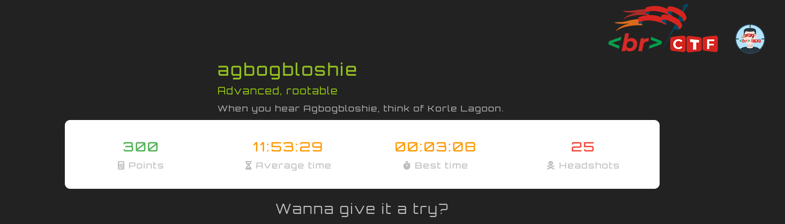
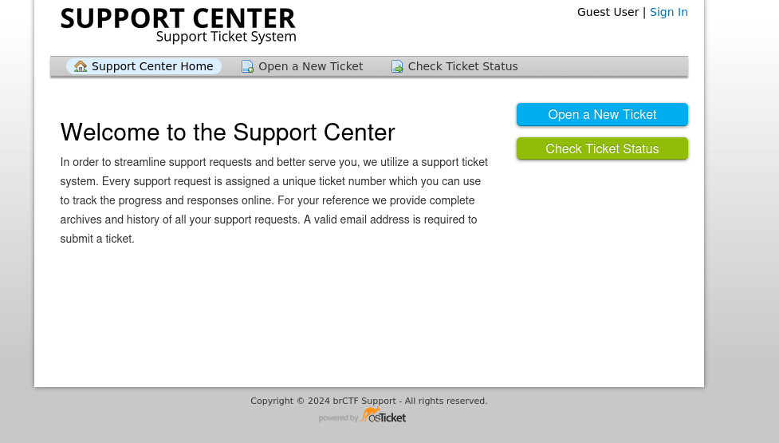
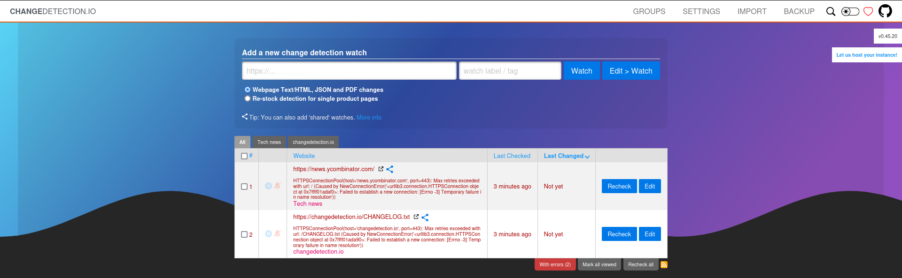
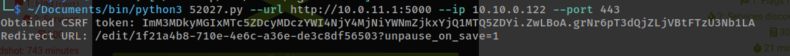
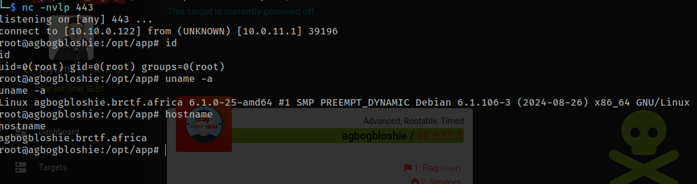

scaning agbogloshie we get 

```
    tcp://10.0.11.1:80
    tcp://10.0.11.1:5000
```

visiting port 80



visiting 5000



port 5000 is the target and we found an exploit

> changedetection <= 0.45.20 Remote Code Execution (RCE)

runing the exploit



and we are root



# agbogloshie done