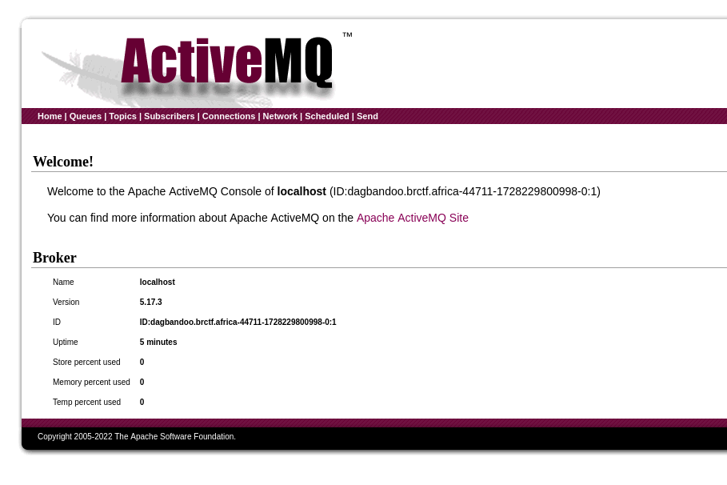
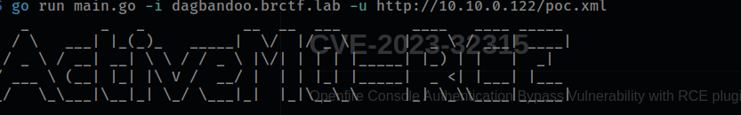
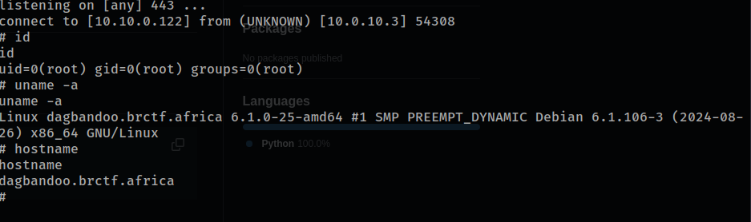

# dagbandoo

scaning dagbandoo

```
The Modern Day Port Scanner.
________________________________________
: http://discord.skerritt.blog         :
: https://github.com/RustScan/RustScan :
 --------------------------------------
Please contribute more quotes to our GitHub https://github.com/rustscan/rustscan

[~] The config file is expected to be at "/home/troylynx/.rustscan.toml"
[~] Automatically increasing ulimit value to 5000.
Open 10.0.10.3:80
Open 10.0.10.3:8161
[~] Starting Script(s)
[~] Starting Nmap 7.94
```

visiting port 80


visiting port 8161 we are faced with a login popup `admin`:`admin` should do the magic



version showing, lets find out if there are any public exploits

> CVE-2023-46604
 
 the exploit works, just dont add the port

 

 and we are root

 

 ## dagbandoo 