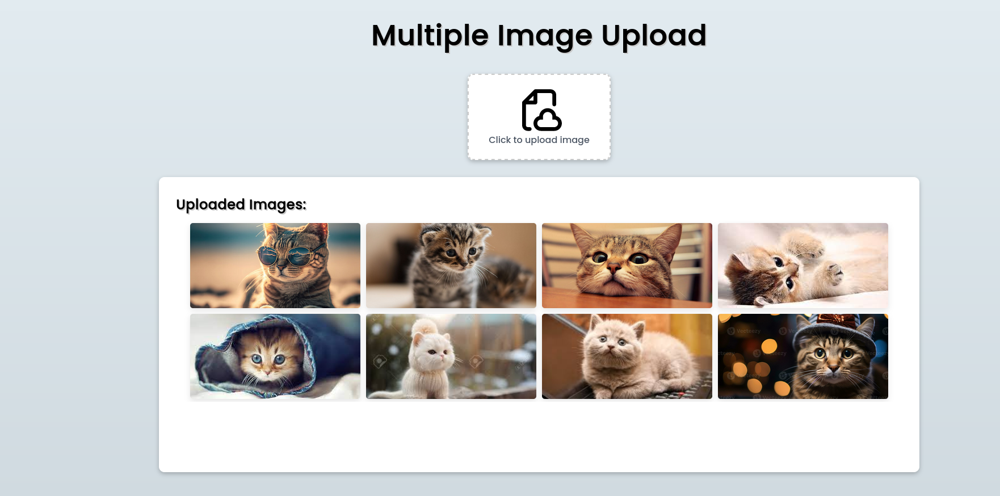
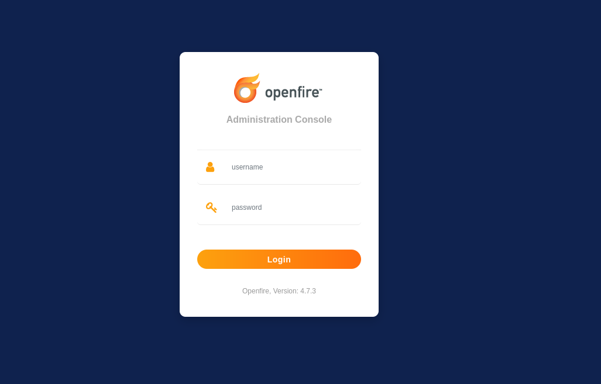
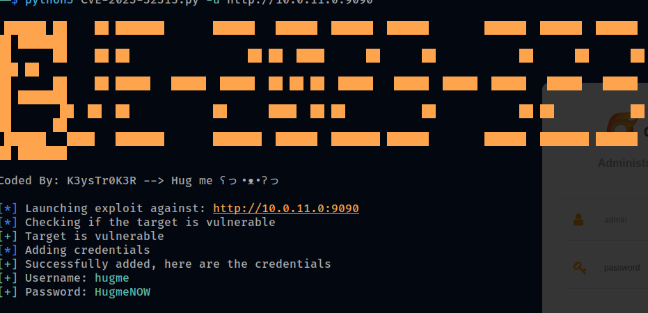
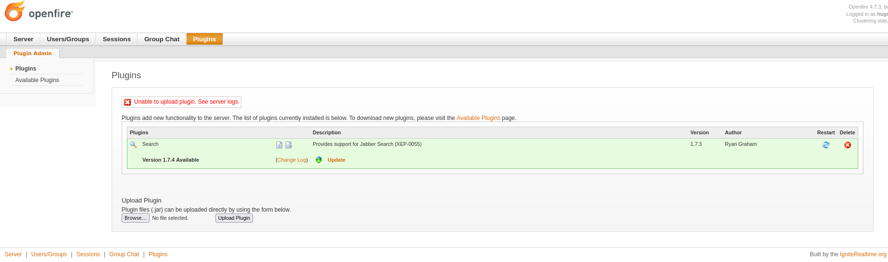
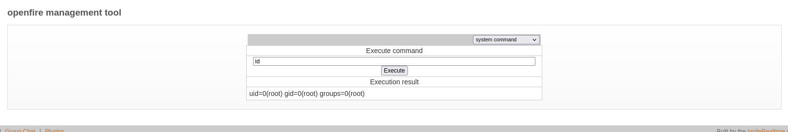

# Kaklo
scanning kaklo, we get two ports

```
The Modern Day Port Scanner.
________________________________________
: http://discord.skerritt.blog         :
: https://github.com/RustScan/RustScan :
 --------------------------------------
Please contribute more quotes to our GitHub https://github.com/rustscan/rustscan

[~] The config file is expected to be at "/home/troylynx/.rustscan.toml"
[~] Automatically increasing ulimit value to 5000.
Open 10.0.11.0:80
Open 10.0.11.0:9090
[~] Starting Script(s)
[~] Starting Nmap 7.94
```

visiting port 80 we get a file upload application


we tried to bypass the file upload to get a shell on the machine but couldnt so we move to the second port 9090



with openfire version displaying, we searched for current exploits and we got one

> CVE-2023-32315

lets run the exploits



the exploit actually creates a user and a mallicious jar file which we will upload to the system



uploading the jar file, will get access to a webshell and we can get a reverse shell from there



## and thats kaklo