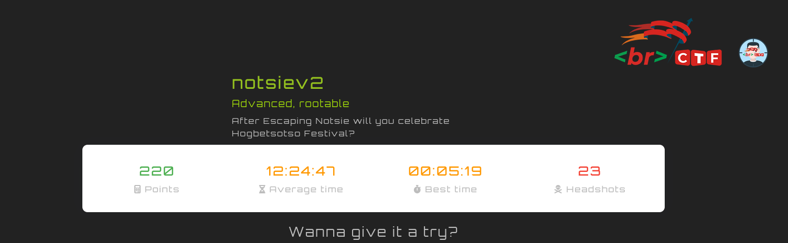
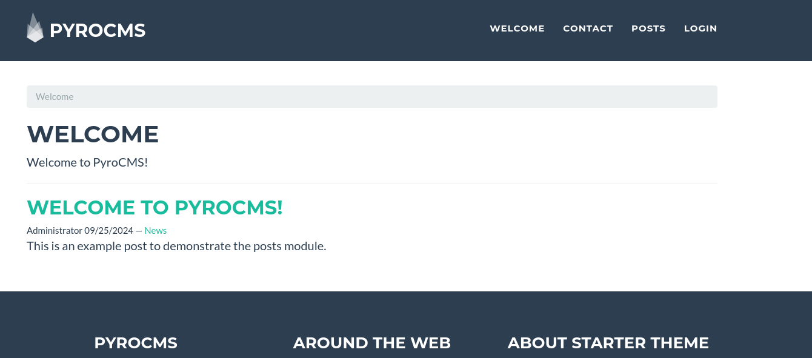
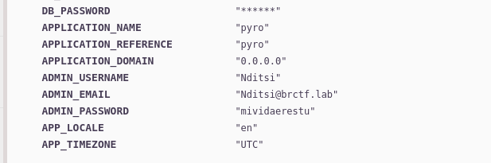
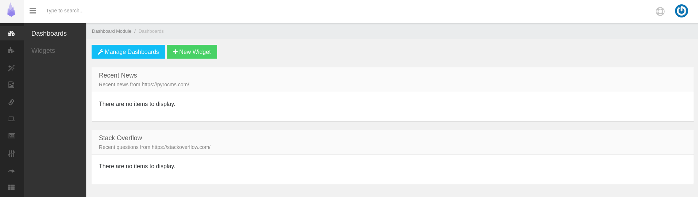
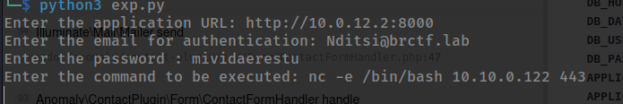
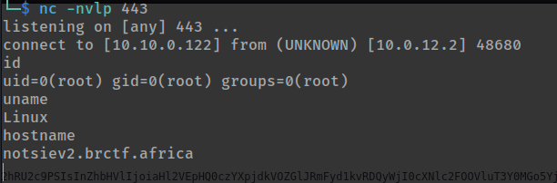

scaning notsiev2 we get only one port 8000

```
tcp://10.0.12.2:8000
```

visiting port 8000



looked around and found admin loginpage which also gave the version of pyro


but there are creds to login and didnt find default creds either

later decided to send a contact message and perfom some XSS and this happed



the contact form errored out giveing us credentias __nice__, so now we login to the dashboard



again we search and found an exploit

> Pyro CMS 3.9 - Server-Side Template Injection (SSTI) (Authenticated)

lets run exploit



shell



## notsiev2 done