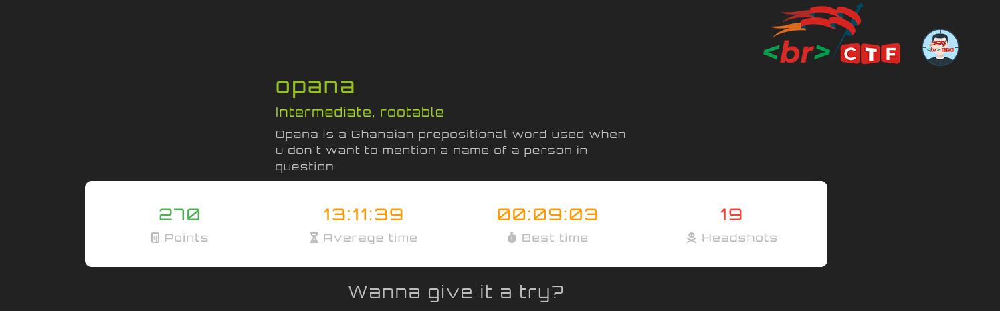
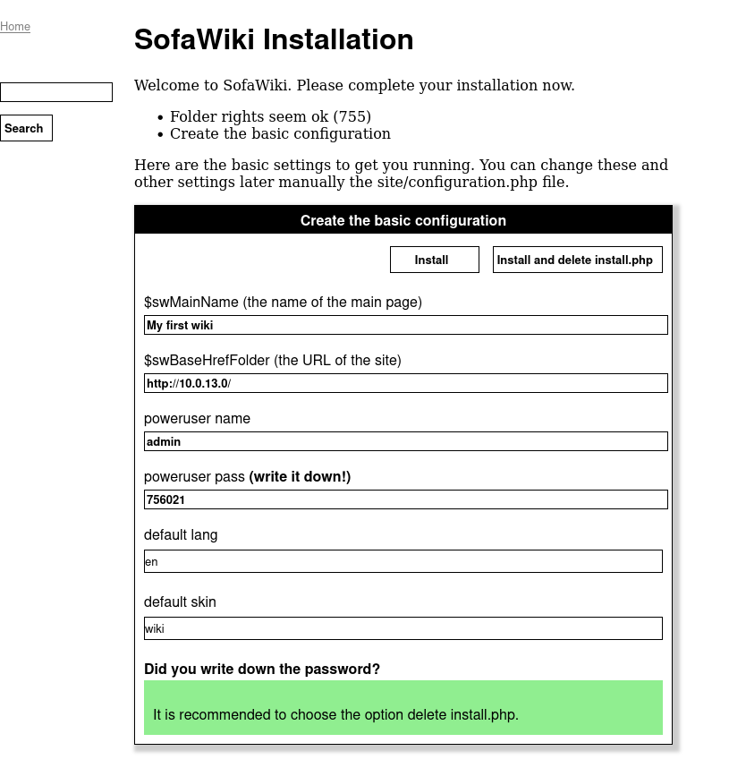
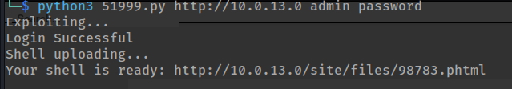
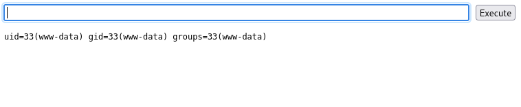
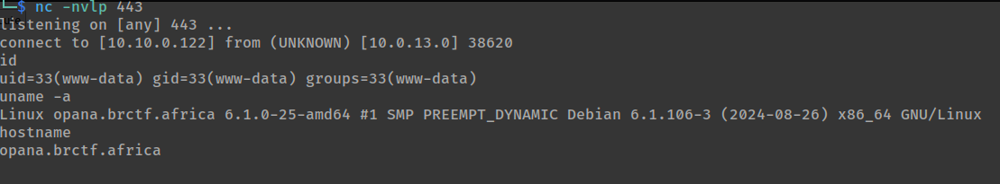
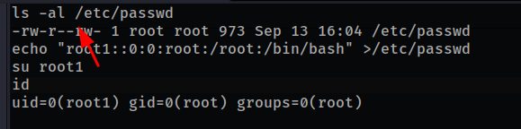

scaning opana gives us only one port i.e port 80

visiting port 80

`sofawikis` create an account, search for exploit..

> SofaWiki 3.9.2 - Remote Command Execution (RCE) (Authenticated)

exploit created a file on the server for use with a webshell

visit the location and you will get codexc on the server

get a revshell using `Netcat`

privesc, the /etc/passwd had a write permission for anyone on the system, we added a user with root privs and we got root

